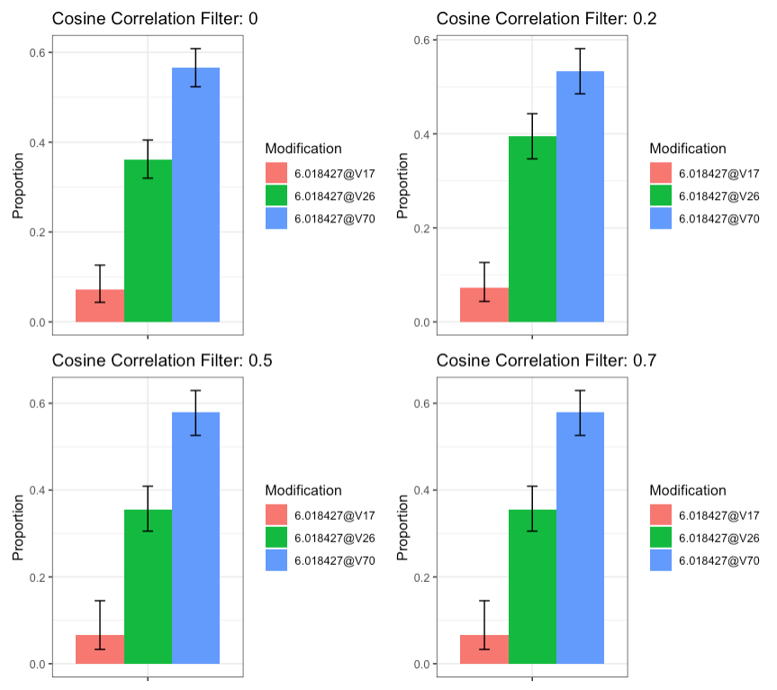

```{r setup, include=FALSE}
knitr::opts_chunk$set(echo = TRUE, message = FALSE, warning = FALSE, error = FALSE)
library(isoforma)
library(dplyr)
```

# What is IsoForma?

IsoForma is a package for quantifying positional isomers (QPI) in MS2 spectra data. 
Currently, analysis of this type of data requires the use of several separate 
tools which is inconvenient and time-consuming. This goal of this
software is to offer all the functionality needed for this analysis in
a streamlined package. 

Much of the backend functionality is drawn from the pspecterlib package, including
generating metadata objects. More information about the backend package
can be found [here](https://github.com/EMSL-Computing/pspecterlib).

IsoForma was built to ingest two main types of data: 1) an MS file (XML-based or 
ThermoFisher raw) or 2) a list of peak_data objects that can be generated with 
pspecterlib. If an MS file is provided, automatic MS2 peak detection options 
are provided. Otherwise, the provided peak data is simply summed together. 

Here are the general steps of the IsoForma algorithm and their respective functions: 

  1. Select scan numbers: Either manually or with pull_scan_numbers()
  
  2. Sum peaks: sum_ms2_spectra()
  
  3. Match experimental and literature fragments for every proteoform: fragments_per_ptm()
  
  4. Sum isotopes and charge states per fragment per proteoform: sum_isotopes()
  
  5. Calculate an abundance matrix: abundance_matrix()
  
  6. Calculate proteoform relative proportions: calculate_proportions()
  
Steps 3-6 can be run all together with our main pipeline function. 

## 1. Select scan numbers

To select scan numbers, either use the pull_scan_numbers() function to automatically
detect and suggest MS2 peaks, or select them yourself and make pspecter peak_data objects out of them. See 
?pspecterlib::make_peak_data or ?pspecterlib::get_peak_data.

```{r Make A Peak Data List}
# Make a list of pspecterlib peak_data objects
PeakDataList <- list(
  readRDS(system.file("extdata", "PeakData_1to1to1_1.RDS", package = "isoforma")),
  readRDS(system.file("extdata", "PeakData_1to1to1_2.RDS", package = "isoforma")),
  readRDS(system.file("extdata", "PeakData_1to1to1_3.RDS", package = "isoforma"))
)

head(PeakDataList[[1]]) %>% knitr::kable()
```

## 2. Sum peaks

The peak summing function will either take a scan_metadata object from pspecterlib
and the selected scan_numbers from pull_scan_numbers() and sum the results, or
use a list of pspecterlib peak_data objects. This function will return one
summed peak_data object.

```{r sum_ms2_spectra}
# Sum selected peaks together 
PeaksSum <- sum_ms2_spectra(
  PeakDataList = PeakDataList,
  PPMRound = 5,
  MinimumAbundance = 0.01
)
head(PeaksSum) %>% knitr::kable()
```

## 3. Match experimental and literature fragments for every proteoform

To generate all proteoforms to test, use the pspecterlib::multiple_modifications
function. Then, pass that list of sequences to the fragments_per_ptm function. If
the isotoping algorithm crashes, considering switching the to IsotopeAlgorithm = "isopat".
This function will return a list of matched_peak objects from pspecterlib. 

```{r fragments_per_ptm}
# Generate a list of PTMs to test
MultipleMods <- pspecterlib::multiple_modifications(
  Sequence = "LQIFVKTLTGKTITLEVEPSDTIENVKAKIQDKEGIPPDQQRLIFAGKQLEDGRTLSDYNIQKESTLHLVLRLRGG",
  Modification = "6.018427,V(17,26,70)[1]",
  ReturnUnmodified = TRUE
)

# Calculate fragments per proteform
AllFragments <- fragments_per_ptm(
   Sequences = MultipleMods,
   SummedSpectra = PeaksSum,
   MaxFragmentCharge = 11, 
   ActivationMethod = "ETD", 
   CorrelationScore = 0, # Here, we don't care about correlation score filtering 
   Messages = FALSE
)

head(AllFragments[[2]]) %>% knitr::kable()
```

## 4. Sum isotopes and charge states per fragment per proteoform

This function will return a table of summed intensities per fragment. 

```{r sum_isotopes}
IsotopesSum <- sum_isotopes(IsoformaFragments = AllFragments)

head(IsotopesSum) %>% knitr::kable()
```

## 5. Calculate an abundance matrix

This function will return an abundance matrix for a selected ion, where each
row is a fragment and each column is a proteoform. The values are summed intensities. 

```{r abundance_matrix}
# Select your ion group of choice when calculating the abundance matrix
AbunMat <- abundance_matrix(
  SummedIsotopes = IsotopesSum,
  IonGroup = "c"
)

head(AbunMat) %>% knitr::kable()
```

## 6. Calculate proteoform relative proportions

This function returns both a table and a plot. 

```{r calculate_proportions}
Proportions <- calculate_proportions(AbundanceMatrix = AbunMat)

Proportions[[1]] %>% knitr::kable()
```

```{r calculate_proportions plot}
Proportions[[2]]
```

## 3-6: Main Pipeline Function

Since steps 3-6 are the same for either pre-selected scans or if pull_scan_numbers()
is used, we do have an "isoforma_pipeline" function to run them all together.

# Accessory Functions

## annotated_spectrum_ptms_plot

Visualize multiple PTM fragment identifications over one plot in a large, interactive
plotly display.

```{r annotated_spectrum_ptms_plot, fig.height = 6, fig.width = 8}
annotated_spectrum_ptms_plot(
  SummedSpectra = PeaksSum, 
  IsoformaFragments = AllFragments
)
```

## ptm_heatmap()

PPM errors per fragment and ppm combination can easily be visualized with this heatmap function. 

```{r ptm_heatmap}
ptm_heatmap(IsoformaFragments = AllFragments)
```

## write_mgf_simple()

This simple MGF writer function can be used to generate MGF files of peak data
for use with external tools. 

# Additional Notes 

## Correlation Score Filter

The cosine correlation filter, built into pspecterlib, was designed to remove lowly
supported fragments in top-down mass spectrometry data, where there are more peaks
than bottom-up data. This approach does not make intuitive sense in IsoForma, which performs 
optimally when all possible fragmented peaks are included. 

Unfortunately, there is currently no formal guidance on a cosine correlation score
threshold for matching peaks. Until such guidance exists for quantifying positional 
isomers, we recommend setting the cosine correlation threshold to 0. 
Below, we have an example of the effect of increasing
the correlation score filter on the 1:4:8 ratio dataset, which does not appear to 
significantly change the data.

```{r, echo = F, fig.height = 4}

```


