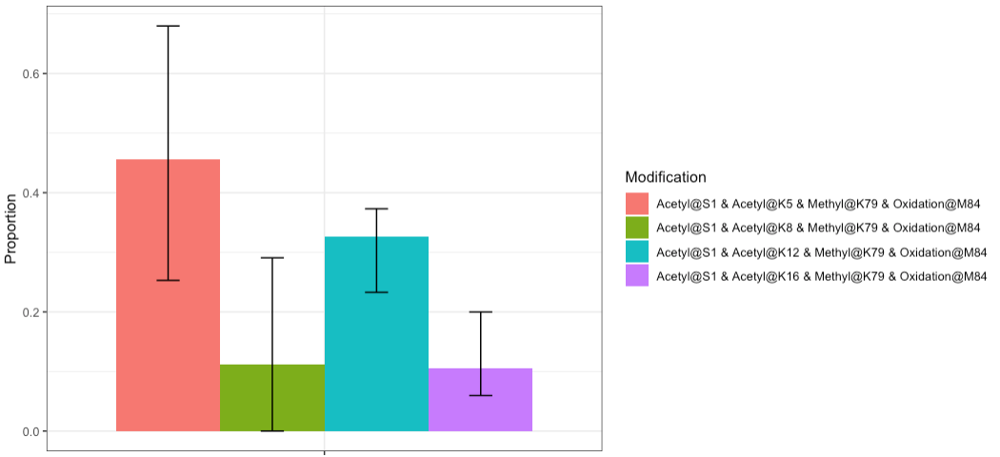

```{r setup, include=FALSE}
knitr::opts_chunk$set(echo = TRUE, message = FALSE, warning = FALSE, error = FALSE)
library(isoforma)
library(pspecterlib)
library(dplyr)
```

# What is IsoForma?

*IsoForma* is a package for quantifying positional isomers (QPI) in MS2 spectra data. 
Currently, analysis of this type of data requires the use of several separate 
tools which is inconvenient and time-consuming. This goal of this
software is to offer all the functionality needed for this analysis in
a streamlined package. 

Much of the back-end functionality is drawn from the *pspecterlib* package. 
More information about the backend package
can be found [here](https://github.com/EMSL-Computing/pspecterlib).

*IsoForma* was built to ingest two main types of data: 1) an MS file (XML-based or 
ThermoFisher raw) or 2) a list of peak_data objects that can be generated with 
*pspecterlib.* If an MS file is provided, automatic MS2 peak detection options 
are provided. Otherwise, the provided peak data is simply summed together. 

Here are the general steps of the IsoForma algorithm and their respective functions: 

  1. Select scan numbers: Either manually or with pull_scan_numbers()
  
  2. Sum peaks: sum_ms2_spectra()
  
  3. Match experimental and literature fragments for every proteoform: fragments_per_ptm()
  
  4. Sum isotopes and charge states per fragment per proteoform: sum_isotopes()
  
  5. Calculate an abundance matrix: abundance_matrix()
  
  6. Calculate proteoform relative proportions: calculate_proportions()
  
Steps 3-6 can be run all together with our main pipeline function. 

We will first walk through an example with the **Pasavento histone dataset** and then
the **Brunner valine dataset.**

## Pasavento Histone Dataset 

#### 1. Select scan numbers

In this dataset, the MS2 scan numbers of peak data that needs to be summed together 
is unknown. Here, use the pull_scan_numbers() function to automatically detect
and suggest MS2 peaks. 

```{r}
# Load raw mzML data 
xml_data <- pspecterlib::get_scan_metadata(MSPath = system.file("extdata", "Example.mzML", package = "isoforma"))

# Pull scan numbers
Sequence <- "SGRGKGGKGLGKGGAKRHRKVLRDNIQGITKPAIRRLARRGGVKRISGLIYEETRTVLKTFLENVIRDSVTYTEHARRKTVTAMDVVYALKRQGRTLYGFGG"
Modifications <- "Acetyl,(1^,5,8,12,16)[2];Methyl,(79)[1];Oxidation,(84)[1]"
Modified_Sequences <- pspecterlib::multiple_modifications(Sequence, Modifications, ReturnUnmodified = TRUE)
Scan_Numbers <- pull_scan_numbers(Sequence = Modified_Sequences[5], ScanMetadata = xml_data, RTStart = 100, RTEnd = 110)

head(Scan_Numbers)
```

#### 2. Sum Peaks

Now sum the peaks using the peak summing function, the scan_metadata object from pspecterlib,
and the selected scan_numbers from pull_scan_numbers().

```{r}
# Sum Peaks
Summed_Peaks <- sum_ms2_spectra(ScanMetadata = xml_data, ScanNumbers = Scan_Numbers)

head(Summed_Peaks)
```

#### 3-6: Main Pipeline Function

Since steps 3-6 are the same for either pre-selected scans or if pull_scan_numbers()
is used, we do have an "isoforma_pipeline" function to run them all together. Here, 
we will use the main pipeline function. To see more details about each of these 
substeps, see the sections below "Brunner Valine Dataset."

Here, a list of 5 objects are returned: 

1. A list of matched peak objects from *pspecterlib* showing all the identified fragments

2. Summed fragment intensities from *isoforma*

3. The abundance matrix where rows are ions and columns are isomers. Each element is
the summed intensity.

4. The calculated proportions with confidence intervals

5. A plot of the calculated proportions

```{r, eval = F}
IsoForma_Example <- isoforma_pipeline(
     Sequences = Modified_Sequences,
     SummedSpectra = Summed_Peaks,
     PrecursorCharge = 16, 
     ActivationMethod = "ECD",
     IonGroup = "c",
     IsotopeAlgorithm = "isopat", # Rdisop is preferred, is faster, and is more accurate, but it tends to crash on Windows
     Message = F 
)
```

```{r, echo = F}

```

## Brunner Valine Dataset

#### 1. Select scan numbers

Here, peaks have been selected by a different software. To generate peak data objects,
see ?pspecterlib::make_peak_data or ?pspecterlib::get_peak_data. Below, we generate 
a list of peak data objects: 

```{r Make A Peak Data List}
# Make a list of pspecterlib peak_data objects
PeakDataList <- list(
  readRDS(system.file("extdata", "PeakData_1to1to1_1.RDS", package = "isoforma")),
  readRDS(system.file("extdata", "PeakData_1to1to1_2.RDS", package = "isoforma")),
  readRDS(system.file("extdata", "PeakData_1to1to1_3.RDS", package = "isoforma"))
)

head(PeakDataList[[1]])
```

## 2. Sum peaks

Now use the list of peak data objects to generate a summed peak_data object.

```{r sum_ms2_spectra}
# Sum selected peaks together 
PeaksSum <- sum_ms2_spectra(
  PeakDataList = PeakDataList,
  PPMRound = 5,
  MinimumAbundance = 0.01
)
head(PeaksSum)
```

## 3. Match experimental and literature fragments for every proteoform

To generate all proteoforms to test, use the pspecterlib::multiple_modifications
function. Then, pass that list of sequences to the fragments_per_ptm function. If
the isotoping algorithm crashes, considering switching the to IsotopeAlgorithm = "isopat".
This function will return a list of matched_peak objects from pspecterlib. 

```{r fragments_per_ptm}
# Generate a list of PTMs to test
MultipleMods <- pspecterlib::multiple_modifications(
  Sequence = "LQIFVKTLTGKTITLEVEPSDTIENVKAKIQDKEGIPPDQQRLIFAGKQLEDGRTLSDYNIQKESTLHLVLRLRGG",
  Modification = "6.018427,(17,26,70)[1]",
  ReturnUnmodified = TRUE
)

# Calculate fragments per proteform
AllFragments <- fragments_per_ptm(
   Sequences = MultipleMods,
   SummedSpectra = PeaksSum,
   PrecursorCharge = 11, 
   ActivationMethod = "ETD", 
   Messages = FALSE
)

head(AllFragments[[2]])
```

## 4. Sum isotopes and charge states per fragment per proteoform

This function will return a table of summed intensities per fragment. 

```{r sum_isotopes}
IsotopesSum <- sum_isotopes(IsoformaFragments = AllFragments)

head(IsotopesSum)
```

## 5. Calculate an abundance matrix

This function will return an abundance matrix for a selected ion, where each
row is a fragment and each column is a proteoform. The values are summed intensities. 

```{r abundance_matrix}
# Select your ion group of choice when calculating the abundance matrix
AbunMat <- abundance_matrix(
  SummedIsotopes = IsotopesSum,
  IonGroup = "c"
)

head(AbunMat)
```

## 6. Calculate proteoform relative proportions

This function returns both a table and a plot. 

```{r calculate_proportions}
Proportions <- calculate_proportions(AbundanceMatrix = AbunMat)

Proportions[[1]]
```

```{r calculate_proportions plot}
Proportions[[2]]
```

# Accessory Functions

## annotated_spectrum_ptms_plot

Visualize multiple PTM fragment identifications over one plot in a large, interactive
plotly display with annotated_spectrum_plots.

## ptm_heatmap()

PPM errors per fragment and ppm combination can easily be visualized with this heatmap function. 

```{r ptm_heatmap}
ptm_heatmap(IsoformaFragments = AllFragments)
```

## write_mgf_simple()

This simple MGF writer function can be used to generate MGF files of peak data
for use with external tools. 

# Additional Notes 

## Modificiation Formats 

Below are examples of different modification specifications and their results. 

```{r}
# Single modification of a single PTM examples 
multiple_modifications("TRICITIES", "Methyl,(3)[1]")
```

```{r}
# Single modification of a single PTM examples 
multiple_modifications("TRICITIES", "1.00727,(3,5,7)[1]")
```

```{r}
# Multiple modifications of a single PTM example
multiple_modifications("TRICITIES", "Methyl,(3,5,7)[2]") 
```

```{r}
# Multiple modifications with a fixed position
multiple_modifications("TRICITIES", "Methyl,(3^,5,7)[2]") 
```

```{r}
# Multiple modifications with two fixed positions 
multiple_modifications("TRICITIES", "Methyl,(3^,5,7^)[2]")
```

```{r}
# Multiple modifications of a single PTM with any "X" residue
multiple_modifications("TRICITIES", "Methyl,(1,2,3,4,5,6,7,8,9)[2]")
```

```{r}
# Multiple modifications with multiple PTMs examples and the base sequence returned
multiple_modifications("TRICITIES", "Methyl,(1)[1];Acetyl,(2,4,9)[1]", ReturnUnmodified = TRUE)
```

```{r}
# Multiple modifications with multiple PTMs examples and the base sequence returned
multiple_modifications("TRICITIES", "Methyl,(1,2,3,4,5,6,7,8,9)[1];Acetyl,(2,4,9)[1]", ReturnUnmodified = TRUE)
```

```{r}
# Multiple modifications with multiple PTMs examples and the base sequence returned
multiple_modifications("TRICITIES", "Methyl,(1^,2,3,4,5,6,7^,8,9)[3];1.00727,(2,4,9)[1]", ReturnUnmodified = TRUE)
```

```{r}
# Combine single and multiple modification examples
multiple_modifications("TRICITIES", "Methyl,(1,2,3,4,5)[1,2]")
```


